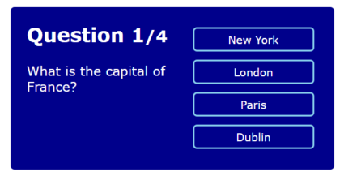
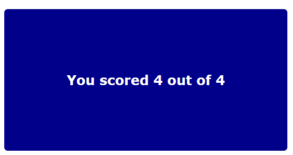

# React Quiz App




The React Quiz App is a web application designed to allow users to take quizzes. It is built using React, making it a dynamic and interactive experience for users. This app allows users to test their knowledge and have fun with educational content. It can be used for educational purposes, training, or simply for entertainment.

## Table of Contents

- [Features](#features)
- [Demo](#demo)
- [Installation](#installation)
- [Usage](#usage)
- [Technologies Used](#technologies-used)
- [Contributing](#contributing)

## Features

- Multiple quizzes on different subjects
- Interactive UI for an engaging experience
- Score tracking to monitor quiz performance
- Support for multiple choice questions

## Demo

A live demo of the React Quiz App can be found at [https://www.example.com/react-quiz-app](Quiz-app-video.webm)

## Installation

To run the React Quiz App locally on your machine, follow these steps:

1. Clone the repository to your local machine:

   ```bash
   git clone https://github.com/your-username/react-quiz-app.git
   cd react-quiz-app
   ```

2. Install the required dependencies using npm or yarn:

   ```bash
   npm install
   # or
   yarn install
   ```

## Usage

After completing the installation steps, you can start the development server with the following command:

```bash
npm start
# or
yarn start
```

This will launch the React Quiz App in your default web browser. You can access it by navigating to `http://localhost:3000/` in your browser.

Once the app is running, you can choose a quiz from the available options and start answering the questions. Your progress and score will be displayed, and at the end of the quiz, you'll receive your final score.

## Technologies Used

The React Quiz App was built using the following technologies:

- React - JavaScript library for building user interfaces
- HTML5 - Markup language for creating the structure of the app
- CSS3 - Styling the user interface and layout
- JavaScript - Programming language for interactive functionality
- [React Router](https://reactrouter.com/) - For handling client-side routing
- [React Hooks](https://reactjs.org/docs/hooks-intro.html) - For managing state

## Contributing

Contributions to the React Quiz App are welcome and encouraged! If you find any issues or want to add new features, feel free to open an issue or submit a pull request. Make sure to follow the existing code style and guidelines.

---